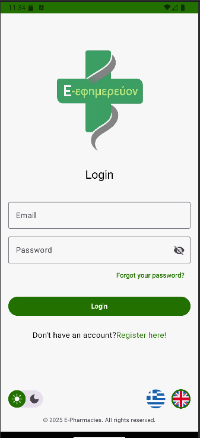

  

<h1 align="center">E-Efimerevon (E-Pharmacies): On-Duty Pharmacy Finder</h1>

  

**E-Efimerevon (E-Pharmacies)** is a modern, native Android application designed to help users in Greece effortlessly locate nearby on-duty pharmacies. Built with Kotlin and Jetpack Compose, the app provides a real-time, interactive map experience powered by OpenStreetMap and Firebase, ensuring users can find an open pharmacy quickly and reliably, especially during emergencies.

---

## 📸 Screenshots

A glimpse into the user experience, from onboarding to finding a pharmacy.

| Welcome & Onboarding | Interactive Map | Pharmacy Details |
| :---: | :---: | :---: |
| A clean introduction to the app's powerful features. | A fluid, real-time map showing on-duty pharmacies. | Detailed information at a glance with quick actions. |
|  |  |  |

| Login & Authentication | Drawer Menu & Features |
| :---: | :---: |
| Secure sign-in powered by Firebase, with multi-language support. | Easy access to profile, settings, in-app purchases, and more. |
|  |  |

---

## ✨ Key Features

-   **Interactive Real-time Map:** Displays all nearby pharmacies on an interactive OpenStreetMap view, with the user's location at the center.
-   **On-Duty Filtering:** A one-tap filter to instantly hide closed pharmacies, showing only those currently on-duty and available.
-   **Radius Search:** Easily find the single closest pharmacy or expand the search radius (e.g., 100m, 500m, 1km, 5km) to suit your needs.
-   **Secure User Authentication:** Full sign-up and login functionality using Firebase Authentication, including email verification and password reset.
-   **Personalized Experience:** Logged-in users can save their favorite pharmacies for quick access.
-   **Detailed Pharmacy Information:** Tapping a pharmacy reveals a bottom sheet with its name, address, phone number, and working hours.
-   **Quick Actions:** Navigate directly using Google Maps or call the pharmacy with a single tap from the details sheet.
-   **Multi-language Support:** Fully localized for both English and Greek users, with an in-app language switcher.
-   **Dark/Light Mode:** The app respects system settings and offers a manual toggle for a comfortable viewing experience day or night.
-   **Monetization Ready:** Includes integrated AdMob banners and an in-app purchase option (via Google Play Billing) to remove ads, demonstrating premium feature handling.

---

## 🏗️ Architecture & Technical Deep Dive

This application is built following modern Android development best practices, emphasizing a clean, scalable, and maintainable codebase.

### MVVM (Model-View-ViewModel) Architecture

The app is structured using the MVVM architecture pattern, which provides a clear separation of concerns:

-   **View (UI Layer):** Built entirely with **Jetpack Compose**. This declarative UI framework allows for building the UI as a set of stateless composable functions that react to state changes. This drastically reduces boilerplate code compared to XML layouts and makes the UI more predictable and easier to manage. The `MapScreen`, `AuthScreen`, etc., are responsible only for displaying the state provided by the ViewModel.

-   **ViewModel:** The ViewModels (`MapViewModel`, `AuthViewModel`) act as the bridge between the UI and the Data Layer. They hold the UI state in `StateFlow`, handle user interactions, and execute business logic. By using `viewModelScope`, all asynchronous operations (like network calls to Firebase) are automatically managed and scoped to the ViewModel's lifecycle, preventing memory leaks.

-   **Model (Data Layer):** This layer is responsible for data sourcing. It interacts directly with **Firebase (Firestore and Authentication)** for remote data and **Jetpack DataStore** for local user preferences (like saved email or onboarding status). This isolates data operations from the rest of the app.

### Key Technical Decisions & Why

-   **Kotlin as the Sole Language:** Chosen for its conciseness, null safety, and excellent support for functional programming and coroutines, which are essential for modern Android development.
-   **Jetpack Compose for the UI:** Instead of traditional XML, Compose was chosen to build a more dynamic, interactive, and maintainable UI with significantly less code. Its state-driven nature works perfectly with the reactive MVVM pattern.
-   **Kotlin Coroutines & StateFlow:** Used for managing all asynchronous operations. `StateFlow` provides a reactive stream of data from the ViewModel to the UI. When pharmacy data, filter status, or user location changes in the ViewModel, the UI automatically recomposes to reflect the new state without any manual view manipulation.
-   **Firebase for Backend:** A powerful and scalable choice.
    -   **Firebase Authentication:** Provides a complete, secure, and easy-to-implement solution for user management, saving significant development time.
    -   **Firestore:** A NoSQL cloud database used to store user profiles and favorite pharmacies. Its real-time listeners (`addSnapshotListener`) mean that changes (like a new favorite being added) are pushed to the app instantly for a reactive experience.
-   **OpenStreetMap (OSM) via osmdroid:** Chosen over Google Maps primarily because it is a powerful, free, and open-source alternative. This avoids potential billing complexities and API usage costs, making it ideal for indie projects.
-   **Jetpack DataStore:** The modern replacement for `SharedPreferences`. It's used to persist simple key-value data asynchronously using Kotlin Coroutines, preventing UI thread blockage.
-   **Google Play Billing Library:** Integrated to handle in-app purchases. This implementation showcases the ability to manage complex monetization flows, from querying products to acknowledging purchases and unlocking premium features for the user.

---

## 🛠️ Technology Stack & Key Libraries

-   **Language:** [Kotlin](https://kotlinlang.org/)
-   **UI Framework:** [Jetpack Compose](https://developer.android.com/jetpack/compose)
-   **Architecture:** [MVVM (Model-View-ViewModel)](https://developer.android.com/jetpack/guide)
-   **Asynchronous Programming:** [Kotlin Coroutines](https://kotlinlang.org/docs/coroutines-overview.html) & [Flow](https://kotlinlang.org/docs/flow.html)
-   **Backend & Database:**
    -   [Firebase Authentication](https://firebase.google.com/docs/auth) (for user management)
    -   [Cloud Firestore](https://firebase.google.com/docs/firestore) (for user profiles & favorites)
-   **Mapping:** [OpenStreetMap (osmdroid)](https://github.com/osmdroid/osmdroid)
-   **Navigation:** [Compose Navigation](https://developer.android.com/jetpack/compose/navigation) with animation support
-   **Local Storage:** [Jetpack DataStore](https://developer.android.com/topic/libraries/architecture/datastore) (for user preferences)
-   **Monetization:**
    -   [Google AdMob](https://admob.google.com/home/) (for banner & interstitial ads)
    -   [Google Play Billing Library](https://developer.android.com/google/play/billing) (for "Remove Ads" IAP)
-   **Location Services:** [Google Play Services Location](https://developers.google.com/android/reference/com/google/android/gms/location/package-summary)

---

## 💡 Code Highlights & Noteworthy Implementations

#### 1. Dynamic & Performant Map Markers
The map markers for pharmacies are not static images. Their size is dynamically adjusted based on the current map zoom level. This subtle detail significantly improves user experience: markers are smaller and less cluttered when zoomed out, and larger and easier to tap when zoomed in. An in-memory cache (`iconCache`) is used to avoid resizing the drawable on every recomposition, ensuring smooth map performance.

#### 2. Fully Reactive Filtering System
The core filtering logic in `MapViewModel` is a great example of reactive programming. Whenever a user toggles the "On-Duty" filter, selects a new radius, or their location updates, the `applyFilters()` function is called. This function re-evaluates the list of pharmacies against the current state (held in a `StateFlow`). The UI, which is collecting this state, automatically and efficiently recomposes to display only the relevant markers, creating a seamless and instantaneous filtering experience.

#### 3. Robust Localization Support
The app implements a `LocaleManager` that correctly handles language switching. It persists the user's language choice and uses the `attachBaseContext` method in `MainActivity` to apply the correct locale *before* the activity is created. This robust approach ensures all resources, from simple text strings to date/number formatting, are displayed correctly across the entire application and prevents common issues associated with in-app language changes.

---

> **Note:** The source code for this project is kept in a private repository and is not publicly available. This repository serves as a showcase of the project's features, architecture, and design for professional evaluation.
